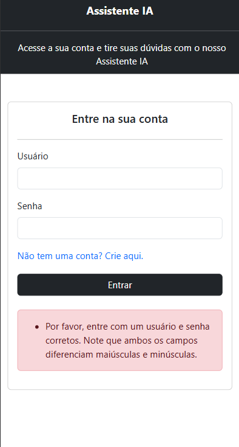
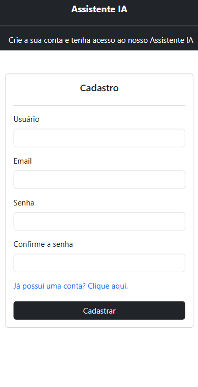
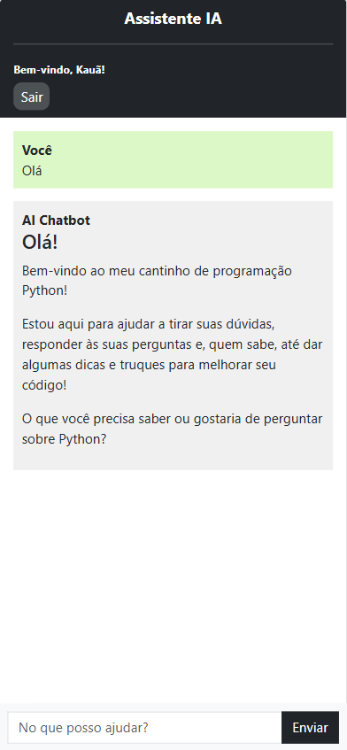

# Assistente IA

**Assistente IA** é um projeto web desenvolvido com Django que integra uma Inteligência Artificial da Meta gratuita oferecida pela [Groq](https://groq.com). Ele oferece um chatbot funcional com sistema de autenticação, histórico de conversas por usuário e um painel administrativo estilizado com **Jazzmin**.

## :rocket: Funcionalidades

- Integração com IA da Meta gratuita pela Groq.
- Autenticação de usuários (login, cadastro e logout).
- Validações no login:
  - Verifica se o usuário existe.
  - Verifica se a senha está correta.
- Validações no cadastro:
  - Verifica formato válido de usuário e e-mail.
  - Verifica se as senhas coincidem.
- Cada usuário pode visualizar apenas o **seu próprio histórico**.
- Interface administrativa customizada com **Jazzmin**.
- Front-end com **Bootstrap**, totalmente **responsivo**.

---

## :lock: Autenticação

### Tela de Login

Insira suas credenciais para acessar o chatbot.

> 

### Validação de Login com Erro

Exemplo de mensagem de erro ao tentar logar com credenciais inválidas.

> 

---

### Tela de Cadastro

Crie uma conta com validação de e-mail, nome de usuário e confirmação de senha.

> 

---

## :speech_balloon: Chatbot com IA

Após o login, o usuário é direcionado ao chatbot, que mostra o nome do usuário logado e um botão para logout. As conversas são armazenadas no histórico pessoal de cada usuário.

> 

---

## :gear: Tecnologias Utilizadas

- Django
- Llama3 (IA da Meta)
- Jazzmin (Admin Panel)
- Bootstrap 5
- HTML5 + CSS3
- SQLite (padrão Django)

---

## :hammer: Como Rodar Localmente

```bash
# Clone o repositório
git clone https://github.com/kauacavalcante24/AI_assistant.git
cd assistente-ia

# Crie o ambiente virtual
python -m venv venv
source venv/bin/activate  # ou .\venv\Scripts\activate no Windows

# Instale as dependências
pip install -r requirements.txt

# Execute as migrações
python manage.py migrate

# Rode o servidor
python manage.py runserver
